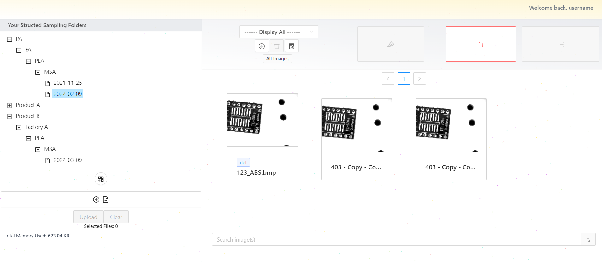
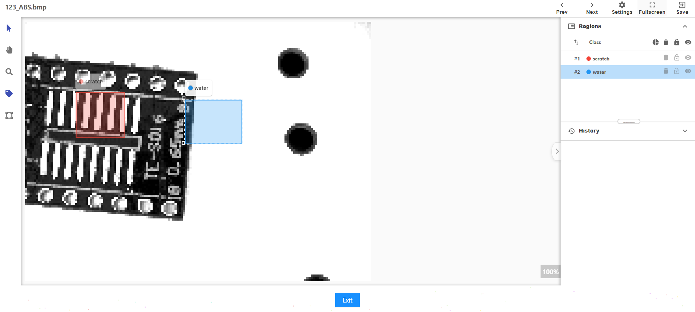

## Image Storage Centre Solution for AI Image Labelling

### DEMO

- Check out my demo video of enterprise Image storage centre and labelling:
  - [AI Image Center](https://www.youtube.com/watch?v=WPQIDdTpDag&feature=youtu.be)
- Check out the project snapshots via:
  - [Project Snapshots](https://www.behance.net/gallery/174480421/AI-Image-Centre-Solution)

### Overview

- The Image Storage Centre Solution for AI Image Labelling is an enterprise application that offers an **innovative image storage solution similar to Google Drive**.
- It provides a centralized platform for **storing and organizing images**, particularly for **AI image labelling purposes**.
- The solution seamlessly integrates with the main AI training application, facilitating efficient preprocessing of images for labelling tasks.

### Features

- Intuitive folder hierarchy for organizing images.
- Admin authority to view and manage all user folders.
- Seamless integration with the main AI training application.
- Support for various image labelling techniques, including bounding boxes and polygons.
- Embedded capability for integration with other applications.
- Deployment using Docker Compose and Helm for simplified setup and management.

### Usage

To utilize the Image Storage Centre Solution:

- Deploy the application using Docker Compose or Helm for streamlined setup.
- Create a folder hierarchy to organize your images effectively.
- Use the image labelling tools, such as bounding boxes or polygons, to label your images accurately.
- Collaborate with team members by sharing folders and assigning appropriate access permissions.
- Leverage the admin authority to oversee and manage all user folders.
- Integrate the solution seamlessly into your main AI training application for efficient preprocessing.

### Deployment

- The Image Storage Centre Solution can be deployed using either Docker Compose or Helm.
